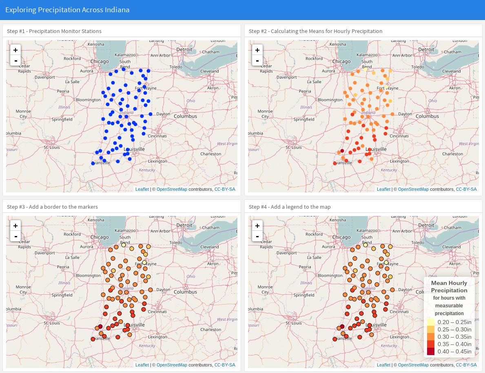
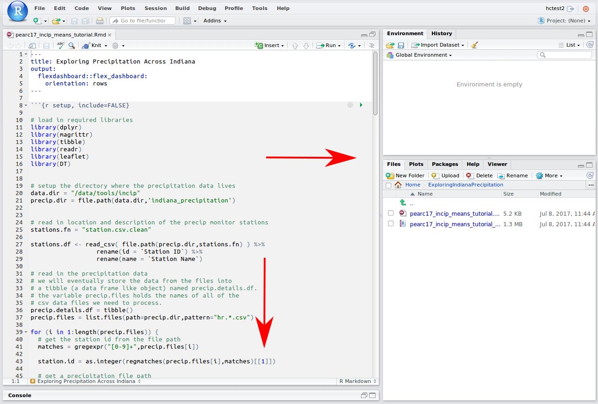
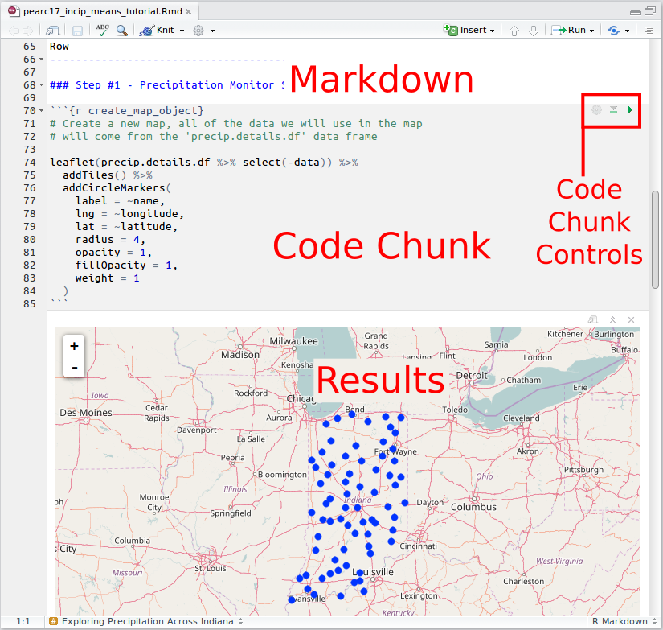
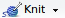
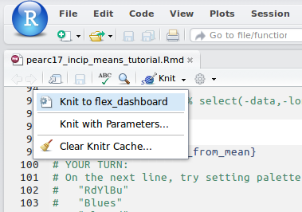
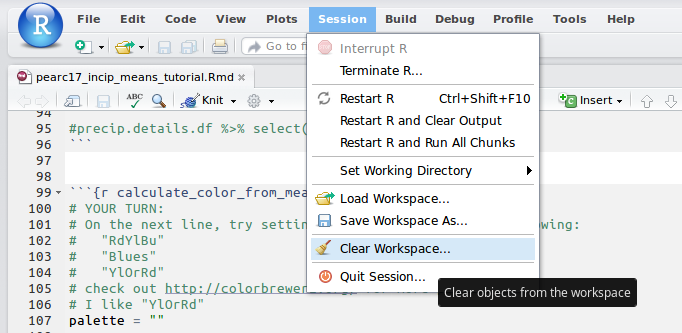

<style>

/*center maps horizontally on the page*/
.html-widget {
  margin: 0 auto;
}

/*center the title of the document*/
h1.title {
  text-align: center;
}

/*center images in a div*/
.tutimg {
  text-align: center;
}

/*highlighing for the "YOUR TURN:"" headers*/
h5 {
  color: red;
  font-weight: bold;
}

/*2 column layout for hints*/
.column-left-2{
  float: left;
  width: 48%;
  margin: 1%;
}

/*4 column layout for hints*/
.column-left-4{
  float: left;
  width: 23%;
  margin: 1%;
}

/*keep 2 and 4 column layout from wrapping inappropriately*/
.clearfix::after {
  content: "";
  clear: both;
  display: table;
}

.colorswatch {
  text-align:center;
  width: 100%;
  height: 2em;
  border-style: solid;
  border-color: #000000;
}

.colorswatchtext {
  text-align: left;
}
</style>

```{r setup, include=FALSE}

knitr::opts_chunk$set(fig.align='center')

# load in required libraries
library(dplyr)
library(magrittr)
library(tibble)
library(readr)
library(leaflet)
library(htmltools)

addColorSwatch <- function(color,value) {
  style = paste("background:",color,sep="")
  div(class = "clearfix",
      div(class = "column-left-2",
          div(class = "colorswatch", style=style, color)
      ),
      div(class = "column-left-2 colorswatchtext", value)
  )
}

showPaletteColors <- function(qpal, value) {
# <div class="clearfix">
# <div class="column-left-2">
# <div class="colorswatch" style="background:#F03B20">&#35;F03B20</div>
# </div> <!-- column-left-2 -->
# <div class="column-left-2 colorswatchtext">
# 0.98323
# </div> <!-- column-left-2 -->
# </div> <!-- clearfix -->
  
  addColorSwatch <- function(color,values) {
    style = paste("background:",color,sep="")
    div(class = "clearfix",
        div(class = "column-left-2",
            div(class = "colorswatch", style=style, color)
        ),
        div(class = "column-left-2 colorswatchtext", value)
    )
  }
  
  t <- ""
  for (value in values) {
    color = qpal(value)
    t <- paste(t,addColorSwatch(color,value))
  }
  
  return(t)
}
```

<br/>

### About the Exercise

In this exercise, we will explore building part of the data analysis tool Indiana Precipitation Explorer (INCIP), which is available on the myGeoHUB.org website at https://mygeohub.org/tools/incip. Along the way, we will get to know a few core components of the R Programming Language like the *data frame* data structure, learn a little bit about manipulating data with R using the *dplyr* library, and build a web application interface that can be deployed on the HUB.

In the previous presentation, you saw examples of Shiny applications, and RMarkdown Documents that could be compiled into static web pages, used as notebooks for a more literate style of computing, or combined with Shiny widgets to create interactive documents. Today we will use historical precipitation data from the National Oceanic and Atmospheric Administration (NOAA) to build a map showing the mean hourly precipitation for hours with measurable precipitation. As we transform our map, we'll keep the old versions and, in the end, we'll build a web page to display them using one of the RMarkdown templates. 

<div class="tutimg">
{width=70%}
</div>

<br/>

### RStudio IDE And RMarkdown Tips

If you are new to the RStudio IDE, here are some tips to get you started.
If you know all this stuff, skip down to the next section labeled **1. Loading the Data**.

<br/>


#### Expand the Code Pane

<div class="clearfix">
<div class="column-left-2">
When you first open RStudio, give yourself some room by expanding the code pane. Press console pane's minimize button to shrink it and pull the main horizontal divider to the right to expand the code pane.
</div> <!-- column-left-2 -->

<div class="column-left-2">
  {.img-responsive}
</div> <!-- column-left-2 -->
</div> <!-- clearfix-->


#### Markdown and Code Chunks

<div class="clearfix">
<div class="column-left-2">
The RMarkdown document we will be editing has both Markdown and code chunks in it. The markdown looks like plain text or wiki syntax. The code chunks start and end with three backticks and have a grey background, like this:

```
```{r}
 I'm a code chunk!
```
```

In a code chunk, there are two controls you can use to run code. They are both located in the upper right corner of the code chunk. Pressing the  button will execute all code chunks above the current chunk. Pressing the  button will execute the current code chunk.
</div> <!--column-left-2 -->

<div class="column-left-2">
{.img-responsive}
</div> <!-- column-left-2 -->
</div> <!-- clearfix -->


#### Knitting the Document

<div class="clearfix">
<div class="column-left-2">
To compile or render the document, use the *Knit* ()  button located just above the Code Pane. This will turn your completed RMarkdown file into a HTML document and launch the document in a new window for you to view.
</div> <!-- column-left-2 -->

<div class="column-left-2">
{.img-responsive}
</div> <!-- column-left-2 -->
</div> <!-- clearfix -->


#### Clear the Session's Variables

<div class="clearfix">
<div class="column-left-2">
If you run the code chunks out of order, you may find that some of the variables have been modified unexpectedly. This could be the cause of maps not showing up correctly in this tutorial. One possible resolution is to clear the session's variables and run all of the code chunks again in order. Use the *Session->Clear Workspace* menu item from the top of the RStudio IDE to clear out the values for all variables. Then press the  button to run the code chunks above the current chunk, and press the  button to run the current code chunk.
</div> <!-- column-left-2 -->

<div class="column-left-2">
{.img-responsive}
</div> <!-- column-left-2 -->
</div> <!-- clearfix -->


### 1. Loading the data

The precipitation data is held in comma separated value (CSV) files that are stored on MyGeoHUB. From the RStudio IDE running on MyGeoHUB, we can access the files in the directory ```/data/tools/incip/indiana_precipitation```. Inside the tutorial's *setup* code chunk, on line 19, you'll see the variable *precip.dir* is setup to hold the path of the directory where the data files live. It looks like this:

```{r data_directory}
# setup the directory where the precipitation data lives
data.dir = "/data/tools/incip"
precip.dir = file.path(data.dir,'indiana_precipitation')
```

The directory holds a file named *stations.csv.clean* with the id, name, latitude, and longitude for each station. On lines 25-27, the CSV file is read into a data structure called a *Data Frame*. You can think of a Data Frame as a table that you can query. The R language's *dplyr* library has a number of functions, like ```filter```, ```mutate```, and ```select```,  that are helpful for querying and manipulating information in data frames.

```{r read_station_attributes, message=FALSE, include=FALSE}
# read in location and description of the precip monitor stations
# station.csv has duplicate entries in it (121739), so we use a
# clean version of the file, station.csv.clean, where the station ids
# are unique.

# YOUR TURN:
# Set the 'stations.fn' variable below to "station.csv.clean"
stations.fn = "station.csv.clean"

stations.df <- read_csv( file.path(precip.dir,stations.fn) ) %>%
                  rename(id = `Station ID`) %>%
                  rename(name = `Station Name`)
```

The *stations.df* data frame looks like this:

```{r show_stations_df, echo=FALSE}
stations.df
```

Along with the stations.csv.clean file, the *precip.dir* directory holds the precipitation data files for each station. The data files have two columns, Time and Precipitation. Lines 29-59 read in the precipitation data files and merge them with information about the monitoring station like the id, name, latitude and longitude. On lines 52-54, we use the ```filter``` function find the row with information about the monitoring station we are currently processing and the ```mutate``` function to add a new column, named *data*, to the row. At the end we store the modified row in a the *precip.details.df* data frame.

```{r aggregate_station_data, message=FALSE, include=FALSE}
# read in the precipitation data
precip.details.df = tibble()
precip.files = list.files(path=precip.dir,pattern="hr.*.csv")

for (i in 1:length(precip.files)) {
  # get the station id from the file path
  matches = gregexpr("[0-9]+",precip.files[i])
  
  station.id = as.integer(regmatches(precip.files[i],matches)[[1]])
  
  # get a precipitation file path
  precip.filepath = file.path(precip.dir,precip.files[i])
  
  # read the precipitation data into a dataframe
  df = read_csv(precip.filepath)

  # create a row with StationID, StationName, lat, lon information from
  # stations.df. Store the precipitation dataframe in a list-column so we
  # can quickly grab it later by indexing by the Station ID.
  station.row <- stations.df %>%
                   filter(id == station.id) %>%
                   mutate(data = list(df))

  # build up a new tibble, row by row, that links station information
  # with the precipitation dataframe.
  precip.details.df = rbind(precip.details.df,station.row)
}
```

Our new data frame, *precip.details.df*, holds station information and precipitation data in a single location. If we take a look at it, we see that the precipitation data is stored in a column named *data* with the type *list*. We can index into the list to access the Time and Precipitation columns of the data frame for each monitor station. This is what *precip.details.df* looks like:


```{r show_merged_dataframe, echo=FALSE}
precip.details.df
```

The monitor station information comes with longitude and latitude coordinates. Let's see what the monitor station locations look like when plotted on a map. We can use the R's Leaflet library to setup a view of the state of Indiana and place markers at the location of each monitor station. By default, the markers will be colored blue.

<br/>

##### Your Turn: Display the Station Locations
Find the code chunk labeled *create_map_object*, around line 68, and execute it pressing the green play button () in the upper right corner of the chunk. Your map will show up underneath the code chunk and should look like this:

```{r plot_station_locations, echo=FALSE}
leaflet(precip.details.df %>% select(-data)) %>%
  addTiles() %>%
  addCircleMarkers(
    label = ~name,
    lng = ~longitude,
    lat = ~latitude,
    radius = 4,
    opacity = 1,
    fillOpacity = 1,
    weight = 1
  )
```

<br/>

### 2. Calculating Precipitation Means

Seeing the locations of each monitor station only tells half the story. It would be interesting to finding out if there are trends in precipitation amounts across the state. Since we have the precipitation data for each monitor station, we can find the average hourly precipitation over the years the data was collected. Then we can color each marker based on this average to help us visually compare the the precipitation around the state.

Let's start by updating our data frame, *precip.details.df*, with the mean precipitation for each station. Here is a reminder of what the data frame looks like:

```{r echo=FALSE}
precip.details.df
```

In the code chunk labeled *calculate_precipitaion_means*, line 87, we calculate the mean of the precipitation values held in the *data* column and store the values back into our data frame in a column named *mean*. The updated data frame is shown below.


```{r calculate_precipitaion_means}
precip.details.df %<>%
  group_by(id) %>%
  mutate(mean = mean(data[[1]][2]$Precipitation)) %>%
  ungroup()

precip.details.df
```

<br/>

##### Your Turn: Calculate the Means
For the code chunk labeled *calculate_precipitation_means*, press the  button to run the code chunk and update the data frame. There is no output from this code chunk.

<br/>

A convenient way of displaying the mean precipitation data on the map is to color the markers based on a range of precipitation values. This allows users to visually inspect the map and estimate which stations may have a higher or lower mean precipitation. Let's use the *colorBin()* function to group the mean values into five equal sized bins and assign a color to each bin. The *colorBin()* function accepts a color palette, a list of values, and the number of bins to group values into. It returns a function, that we will store in the variable *qpal*, that can be called to query the color bin that a value falls into.

For example, in the code below, we create a queryable palette, named *qpal*, by specifying a color palette (```palette = "Blues"```), the domain or range of our values (a random uniform distribution of 10 numbers between 0 and 1), and the number of bins we want the values to fall within (```nbins = 5```):

```{r palette_binning_example}
palette = "Blues"
values = runif(10,min=0,max=1)
nbins = 5

qpal = colorBin(palette,values,nbins)
```

Above, we used random numbers for our *values* variable. Let's see what color bins they end up falling into:

```{r , echo=FALSE, results="hold"}

#for (value in sort(values)) {
#  addColorSwatch(qpal(value),value)
#}

values <- sort(values)
addColorSwatch(qpal(values[1]),values[1])
addColorSwatch(qpal(values[2]),values[2])
addColorSwatch(qpal(values[3]),values[3])
addColorSwatch(qpal(values[4]),values[4])
addColorSwatch(qpal(values[5]),values[5])
addColorSwatch(qpal(values[6]),values[6])
addColorSwatch(qpal(values[7]),values[7])
addColorSwatch(qpal(values[8]),values[8])
addColorSwatch(qpal(values[9]),values[9])
addColorSwatch(qpal(values[10]),values[10])
```

<br/>

##### Your Turn: Create a Queryable Palette
Now it's your turn to create a queryable palette for our map markers. In the code chunk labeled *calculate_color_from_mean*, line 97, use the colorBin() function to generate a palette for our precipitation means. Be sure to fill in these three items:

1. Choose a color palette (Line 105)
2. Specify the domain for our precipication mean values (Line 116)
3. Set the number of bins the values can fall into (Line 121)

Your code should look something like this:

```{r calculate_color_from_mean}
# YOUR TURN:
# On the next line, try setting palette to one of the following:
#   "RdYlBu"
#   "Blues"
#   "YlOrRd"
# check out http://colorbrewer2.org/ for more palettes
# I like "YlOrRd"
palette = "YlOrRd"

# YOUR TURN:
# Set the domain of values to the mean column in our data frame:
#   precip.details.df$mean
values = precip.details.df$mean

# YOUR TURN:
# Choose the number of bins. A good choice is an integer between 2 and 7
# I like 5
nbins = 5

# Create a palette we can query for which bin a value falls into.
qpal = colorBin(palette,values,nbins)

# Add a column named 'color' to our data frame. It holds
# the bin each station's mean precipitation falls into.
precip.details.df %<>%
  mutate(color = qpal(mean))
```

**When you have completed updating the code chunk, run it by pressing the  button in the code chunk controls.**

<br/>

Great! Our updated data frame now has a column named *color*, which describes which bin the mean precipitation value falls into. Let's have a look:

```{r show_color_column, echo=FALSE}
# print out the data frame
precip.details.df
```

The next task is to update our map to show our custom color for the marker instead of the default blue color. In the code chunk labeled *plot_station_locations_with_colors*, line 135, we create a map using the ```leaflet()``` function and then use the ```addCircleMarkers()``` function to place circle markers on the map at the locations of the monitor stations. We need to update this map declaration to use the values we stored in the *color* column of our data frame.

<br/>

##### Your Turn: Color the Map Markers
Add the following argument to the ```addCircleMarkers()``` function to tell the map to color the markers using the *color* column we generated earlier from our custom color palette and bins:

```color = ~color```

After you have made the change, your code chunk should look like this:

```{r plot_station_locations_with_colors, eval=FALSE}
map <- leaflet(precip.details.df %>% select(-data)) %>%
        addTiles()

map %>%
  # create the binned color marker
  addCircleMarkers(
    label = ~name,
    lng = ~longitude,
    lat = ~latitude,
    radius = 4,
    opacity = 1,
    fillOpacity = 1,
    # YOUR TURN:
    # On the next line, add the argument: color = ~color,
    color = ~color,
    weight = 1
  )
```

<br/>

##### Your Turn: Generate an Updated Map
Run the code chunk, using the  button in the upper right corner of the chunk, to see what the updated map looks like. The markers should now be a range of colors, similar to this one:
```{r show_updated_map_with_color_binned_markers, echo=FALSE}
map <- leaflet(precip.details.df %>% select(-data)) %>%
        addTiles()

map %>%
  # create the binned color marker
  addCircleMarkers(
    label = ~name,
    lng = ~longitude,
    lat = ~latitude,
    radius = 4,
    opacity = 1,
    fillOpacity = 1,
    # YOUR TURN:
    # On the next line, add the argument: color = ~color,
    color = ~color,
    weight = 1
  )
```

<br/>

### 3. Add Marker Borders

The markers now show another dimension of information from our data frame, the binned mean precipitation. If you used the *'YlOrRd'* palette, you may notice that some of the markers are a little hard to see. For example, the light yellow marker in the north central part of Indiana, near the city of South Bend, almost blends in with base map background. One easy way to solve this problem is to place a slightly larger black marker behind the marker displaying our bin color. This will give the effect of the marker having a border, helping to distinguish it from other artifacts on the map.

In the code chunk labeled *add_black_background_marker*, line 161, we create two types of markers on the map. The first marker is a black marker that will act as a border. The second marker sits on top of the black marker and shows the binned color for the mean precipitation value.

<br/>

##### Your Turn: Create Background Markers
Modify the first marker in the code chunk to:

1. Set *addCircleMarkers()*'s color argument to "#000000", the hexadecimal value for the HTML color representing black.
2. Set the line width (weight) to 3, a value slightly larger than that of the second marker.

After you have made the change, the code chunk should look something like this:

```{r add_black_background_marker}
map %<>%
  # create the black border marker
  addCircleMarkers(
    lng = ~longitude,
    lat = ~latitude,
    radius = 4,
    opacity=1,
    fillOpacity = 0,
    # YOUR TURN:
    # 1. Set the color argument to "#000000"
    color = "#000000",
    # YOUR TURN:
    # 2. Set the weight argument to 3
    weight = 3
  ) %>%
  # create the bin color marker
  addCircleMarkers(
    label = ~name,
    lng = ~longitude,
    lat = ~latitude,
    radius = 4,
    opacity = 1,
    fillOpacity = 1,
    color = ~color,
    weight = 1
  )
```

<br/>

##### Your Turn: View Map with Updated Markers
Now run the code chunk to confirm that the updated map shows a border around the markers. Press the  button in the upper right corner of the chunk to execute the code.

```{r show_map_with_border_around_markers, echo=FALSE}
map
```

<br/>

### 4. Add a Legend to the Map

The black border around the colored marker helps users distinguish them from a similarly colored background. The map is missing one more item. No map is complete without a legend and it is especially important in this case. Having the colored markers on the map looks nice, but without the legend, users don't know what the colors mean.

We'll use the ```addLegend()``` function to add a legend to the map. In the code chunk labeled *add_legend_to_map*, line 194, the ```addLegend()``` function accepts a number of parameters telling the map how to configure the legend, like title, placement, and background opacity.

<br/>

##### Your Turn: Setup Map Legend
Adjust the following parameters:

1. Set the *pal* argument to *qpal*, the name of our custom binned color palette function.
2. Set the *values* argument to *~mean*, the column in our data frame that holds the calculated mean precipitation values.

After making the adjustments, the code chunk should look like this:

```{r}
map %<>% 
  addLegend(
    "bottomright",
    title = "<center>Mean Hourly<br>
             Precipitation<br/>
             <small>
               for hours with<br/>
               measurable<br/>
               precipitation
             </small></center>",
    opacity = 1,
    labFormat = labelFormat(suffix="in"),
    # YOUR TURN:
    # Set the pal argument to our custom binned palette function, qpal
    pal = qpal,
    # YOUR TURN:
    # Set the values argument to the mean precipitation values, ~mean
    values = ~mean
  )
```

<br/>

##### Your Turn: View Map with Legend
Execute the code in the code chunk using the  button in the upper right corner of the chunk. Do you see our new legend on the map? It should show what values the marker colors correspond to.

```{r, echo=FALSE}
map
```

<br/>

### 5. Putting it all Together

You may not have noticed, but the file we have been editing is actually an RMarkdown document. We have been mixing our R code with Markdown wiki syntax and executing the code chunks just as we would in a literate computing style Notebook.

If you go back through the code you may notice syntax in between the code chunks like this:

```
Row
-------------------------------------

### Step #1 - Precipitation Monitor Stations
```

and like this:

```
### Step #4 - Add a legend to the map
```

These are RMarkdown wiki syntax that give hints about how to format the file when rendered as a web page. At the top of the file, exists this YAML declaration:

```
---
title: Exploring Precipitation Across Indiana
output:
  flexdashboard::flex_dashboard:
    orientation: rows
---
```

All RMarkdown files have a YAML declaration at the top. This one states that the file should be rendered as a FlexDashboard, which is one of the RMarkdown templates that allow developers to quickly generate a dashboard from the R and Markdown code in the file. There are a number of different styles of FlexDashboards and you can learn more about them at http://rmarkdown.rstudio.com/flexdashboard/. 

Our FlexDashboard contains a 2x2 grid of the maps we have created today. We can render it to HTML by using the *Knit* () button near the top of the RStudio IDE.

<br/>

##### Your Turn: Generate an HTML Document
Press the  button, just above the code pane, to generate and view our HTML document. A new window should pop up with all of the maps you generated in this exercise.

<div class="tutimg">
{width=70%}
</div>


<br/>

### 6. Use the Map for Analysis

Now that we have built a web page that displays our station locations on a map and shows us mean hourly precipitation for hours with measurable precipitation, let's use that map to learn something new!

Visually inspect the map.

1. Is there a trend in the recorded mean hourly precipication across the state of Indiana?
2. Can you tell which station looks like it has the highest mean hourly precipitation?

We can use the ```filter()``` and ```select()``` functions to query this information from the data frame to confirm our suspicion. The ```filter()``` function finds the row where the *mean* column is equal to the ```max()``` of all values in the column. The ```select()``` function returns the *name* column for that row.

```{r find_highest_mean_precip}
highmean.station.name <- precip.details.df %>%
                           filter(mean == max(mean)) %>%
                           select(name) %>%
                           .[[1]]
```

Did you pick the *`r highmean.station.name`* station?

<br/>

### Exercise Completed!

Congratulations, you have completed this exercise. In the next section, you will learn more about publishing applications like this on the HUBzero Platform.
